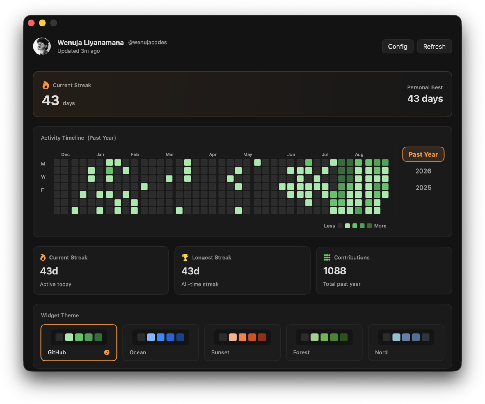
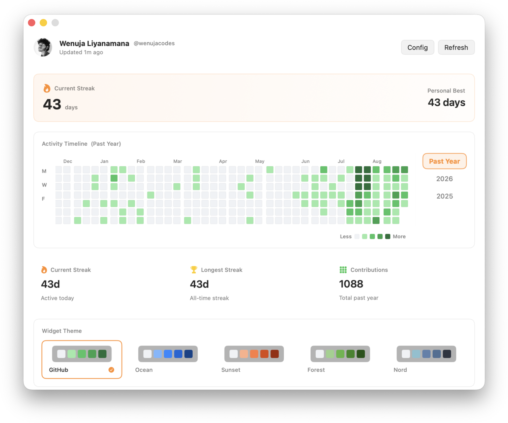
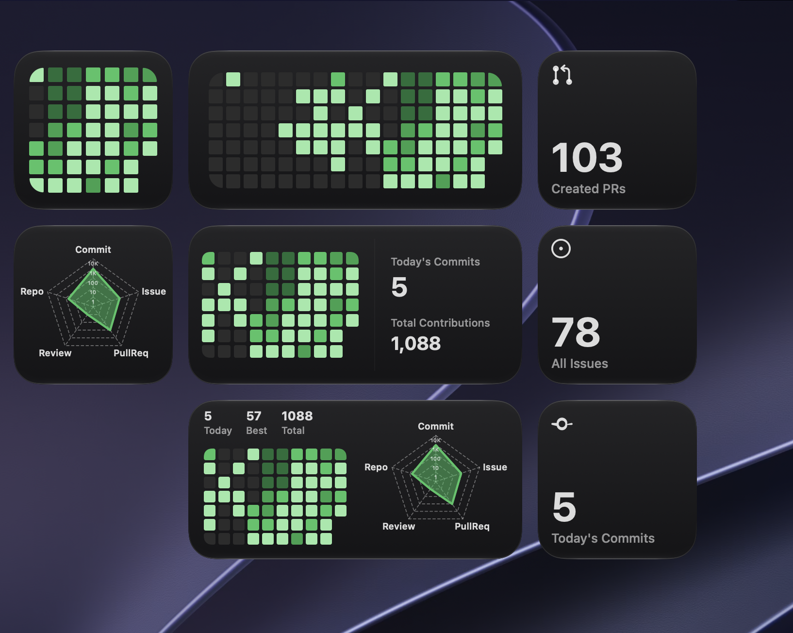
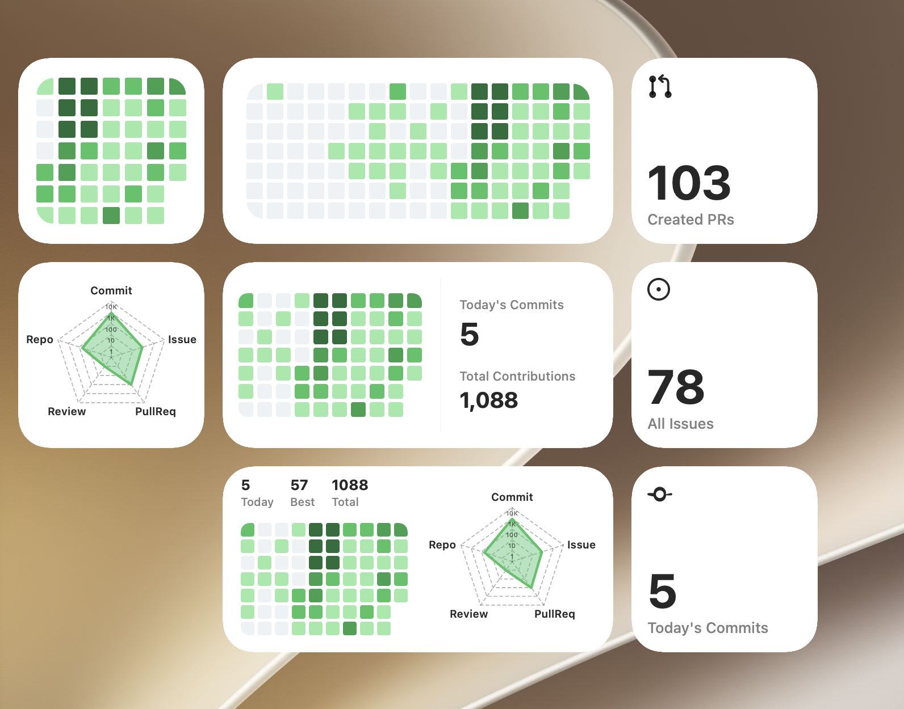

<div align="center">

# GitStreak 🔥

### **Make your coding habit visible on your macOS desktop.**

A native macOS application & WidgetKit engine bringing your GitHub contribution matrix, active streaks, pull requests, and open issues directly to your desktop wallpaper.
<br/>
<br/>

> ⭐ **If you find GitStreak helpful, please star the repository to support development and help others discover it!** ⭐


<br/>
</div>

<br/>

## 📸 Visual Showcase

### Application
| Dark Mode | Light Mode|
| :---: | :---: |
|  |  |

<br/>

### Widgets
| Dark Mode Widgets | Light Mode Widgets |
| :---: | :---: |
|  |  |

---

## 🔥 Key Features

### 🖥️ Native Desktop Wallpaper Widgets
* **Pull Requests Widget**: Real-time tracker for PRs created, assigned, mentioned, or review requested.
* **Issues Widget**: Live metrics for open and assigned GitHub issues with custom filters.

### 🎛️ Customization & Filtering
* **Widget Metrics Filter**: Pick between PR categories (*Created*, *Assigned*, *Mentioned*, *Review Requests*) and Issue categories (*All Open*, *Assigned to Me*).
* **6 Theme Color Palettes**:

### ⚡ Performance & Security
* **Single GraphQL Call**: Fetches contributions, PRs, and Issues in a single GraphQL query at zero extra rate-limit cost.
* **Smart Local Cache**: Multi-year switching with instant cache-first rendering and 15-minute background refresh.
* **100% Serverless & Private**: Credentials stored in macOS Keychain with triple-layer self-healing persistence across app updates.

---

## 📥 Installation

### Option 1: Direct Download

1. Download the latest release disk image: [**GitStreak-v1.1.8.dmg**](https://github.com/wenujacodes/GitStreak/releases/latest/download/GitStreak-v1.1.8.dmg)
2. Open `GitStreak-v1.1.8.dmg` and **drag `GitStreak.app` into the `Applications` folder shortcut** inside the installer window.
3. Launch **GitStreak** from your `/Applications` folder!

> [!IMPORTANT]
> **macOS Gatekeeper Installation Notes**
> 
> - **Avoid `"Could not install / This Mac could not verify the app"` error**:
>   Do **not** double-click `GitStreak.app` while it is still inside the `.dmg` window. **Drag `GitStreak.app` into `/Applications` first**, then launch it from your `/Applications` folder!
> 
> - **Bypass `"Unidentified Developer"` Prompt (First Launch Only)**:
>   Because GitStreak is distributed open-source via GitHub Releases:
>   1. Open **System Settings** → **Privacy & Security**.
>   2. Scroll down to the **Security** section.
>   3. Click **"Open Anyway"** next to GitStreak.
>   *(Or right-click `GitStreak.app` in `/Applications` → select **Open** → click **Open**).*

### Option 2: Build from Source

```bash
# 1. Clone the repository
git clone https://github.com/wenujacodes/GitStreak.git
cd GitStreak

# 2. Install XcodeGen (if not already installed)
brew install xcodegen

# 3. Generate Xcode project & build
make generate
make build

# 4. Install & Launch GitStreak
make run
```

---

## 🛠️ Desktop Wallpaper Widget Setup

1. Right-click anywhere on your macOS **Desktop Wallpaper**.
2. Click **Edit Widgets...**
3. Search for **GitStreak** in the widget gallery.
4. Drag your preferred widget size (**Small**, **Medium**, **Large**, **PRs**, or **Issues**) onto your desktop!

---

## 💻 Tech Stack

* **Platform Target**: macOS 14.0+ (Sonoma / Sequoia)
* **Language**: Swift 6.0 (Strict Concurrency)
* **Frameworks**: SwiftUI, WidgetKit, Security (Keychain), Sparkle 2.6
* **API**: GitHub GraphQL API v4
* **Tooling**: XcodeGen, XCTest, Make, `create-dmg`

---

> [!IMPORTANT]
> **Active Early Development**
> * **Found a bug or issue?** Please [open a GitHub Issue](https://github.com/wenujacodes/GitStreak/issues) - we fix issues quickly!
> * **Updates**: Automatic in-app update checks are enabled via Sparkle. If an update notice is delayed, check back on this repository for the latest release downloads.
> * **Contributors & Community**: Contributions, bug reports, and feature suggestions are warmly welcomed! Feel free to submit Pull Requests or open issues.

---

## 📄 License

Source-Available under the [Business Source License 1.1 (BSL 1.1)](LICENSE) © 2026 Wenuja Liyanamana. Free for non-commercial personal use and open-source contributions.
